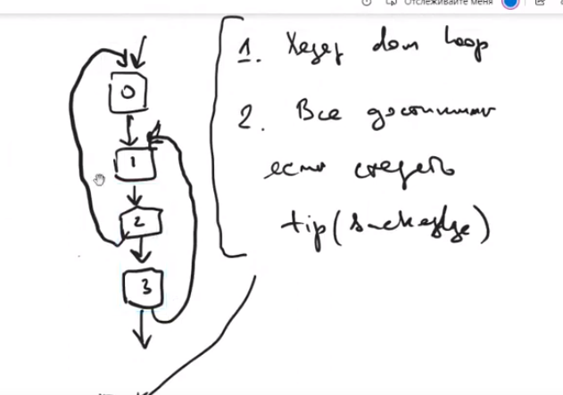

# Заметки по доминаторам
- Back edge: m->n это back edge если n доминирует m
- Reverse post order - топологическая сортировка остовного дерева
- Если обходить DAG граф в RPO, то множество доминаторов строится за один проход.

Алгоритм:
1. строим дерево доминаторов:
  - строим остовное дерево и сортируем его топологически
  - итеративно строим множество доминаторов для RPO
2. обходим граф и ищем back edges через множество доминаторов
   Если убрать все back edges из сводимого графа, то получится DAG
3. Находим множество хедеров и строим IDF по формуле со слайдов

Определение natural loop из интернета:
находим сильно связную компаненту. В ней ищем back edge n->h. 
Все узлы, которые имеют путь до n не проходя через h входят в natural loop. 

## Концепции проектирования
1. Нода не должна умметь работать с собой тк это не ее задача.
2. Для работы с нодами необходимо использовать билдеры.
3. Публичный интерфейс билдера позволяет только создавать ноды и ходить по дереву.
4. Наследники билдеров могут редактировать граф
5. Граф билдеры хранят внутри себя массив со всеми сделанными нодами. Таким образом они автоматически удаляются вместе с билдером.
6. 

## Вопросы
- 0123 это natural loop?

